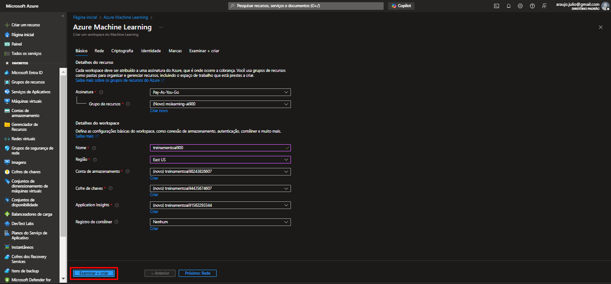
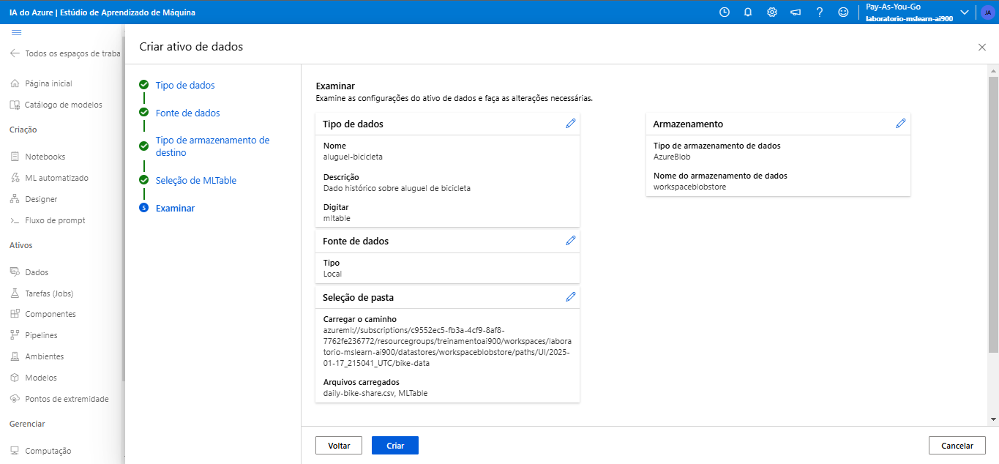

# Explore o machine learning automatizado no Azure Machine Learning

 ### Readme treinamento ai-900 DIO

#### Crie um espaço de trabalho do Azure Machine Learning

 Para usar o Azure Machine Learning, você precisa provisionar um workspace do Azure Machine Learning na sua assinatura do Azure.
Então você poderá usar o Azure Machine Learning Studio para trabalhar com os recursos no seu workspace.

**1**. Entre no portal do Azure usando https://portal.azure.com suas credenciais da Microsoft.

**2**. Selecione ***+ Criar um recurso***, pesquise por ***Machine Learning*** e crie um novo recurso do Azure Machine Learning com as seguintes configurações:
    
**Assinatura** : Sua assinatura do Azure.  
**Grupo de recursos** : Crie ou selecione um grupo de recursos.  
**Nome** : Insira um nome exclusivo para seu espaço de trabalho.  
**Região** : Leste dos EUA.  
**Conta de armazenamento** : Observe a nova conta de armazenamento padrão que será criada para seu espaço de trabalho.  
**Cofre de chaves** : Observe o novo cofre de chaves padrão que será criado para seu espaço de trabalho.  
**Insights do aplicativo** : Observe o novo recurso padrão de insights do aplicativo que será criado para seu espaço de trabalho.  
**Registro de contêiner** : Nenhum ( um será criado automaticamente na primeira vez que você implantar um modelo em um contêiner ).  

**3**. Selecione Review ***+ create*** e, em seguida, selecione Create . Aguarde a criação do seu workspace (pode levar alguns minutos) e, em seguida, vá para o recurso implantado.

#### Azure Machine Learning Studio

**1**. No seu recurso de espaço de trabalho do Azure Machine Learning, selecione Iniciar estúdio (ou abra uma nova guia do
navegador e navegue até https://ml.azure.com e entre no estúdio do Azure Machine Learning usando sua conta da Microsoft).
Feche todas as mensagens exibidas.

**2**. No Azure Machine Learning Studio, você deve ver o seu workspace recém-criado. Caso contrário, selecione All workspaces no menu à esquerda e, em seguida, selecione a workspace que você acabou de criar.

***Use o aprendizado de máquina automatizado para treinar um modelo. Neste exemplo, usaremos um conjunto de dados de detalhes históricos de aluguel de bicicletas para treinar um modelo que prevê o número de aluguéis de bicicletas que devem ser esperados em um determinado dia, com base em características sazonais e meteorológicas.***

**1**. No Azure Machine Learning Studio , visualize a página ML automatizado (em Criação ).  
**2**. Crie um novo trabalho de ML automatizado com as seguintes configurações, usando Avançar conforme necessário para avançar pela interface do usuário:

### Configurações básicas :

**Nome do trabalho** : O campo Nome do trabalho já deve estar preenchido previamente com um nome exclusivo. Mantenha-o como está.  
**Novo nome do experimento** : mslearn-aluguel-biclicletas  
**Descrição** : Aprendizado de máquina automatizado para previsão de aluguel de bicicletas  
**Tags** : nenhuma

    
### Tipo de tarefa e dados :

> **Selecione o tipo de tarefa** : Regressão  
**Selecionar conjunto de dados** : Crie um novo conjunto de dados com as seguintes configurações:
        
#### Tipo de dados :

>**Nome** : aluguel-bicicleta  
**Descrição** : Dados histórico sobre aluguel de bicicleta  
**Tipo** : Tabela (mltable)

#### Fonte de dados :

Selecione a opção ***"De arquivos locais"***.

#### Tipo de armazenamento de destino :
        
>**Tipo de armazenamento de dados** : Azure Blob Storage  
**Nome** : workspaceblobstore

    
    Seleção de MLtable :
     
        Pasta de upload : Baixe e descompacte a pasta que contém os dois arquivos que você precisa enviar https://aka.ms/bike-rentals

    Selecione Criar . Após a criação do conjunto de dados, selecione o conjunto de dados bike-rentals para continuar a 
    enviar o trabalho de ML automatizado.

    Configurações da tarefa :

       . Tipo de tarefa : Regressão
       . Conjunto de dados : aluguel de bicicletas
       . Coluna de destino : aluguéis (inteiro)
       . Configurações adicionais :

            . Métrica primária : NormalizedRootMeanSquaredError
            . Explique o melhor modelo : Não selecionado
            . Habilitar empilhamento de conjunto : Não selecionado
            . Usar todos os modelos suportados : Não selecionado. Você restringirá o trabalho para tentar apenas alguns algoritmos específicos.
            . Modelos permitidos : Selecione apenas RandomForest e LightGBM — normalmente você tentaria o máximo possível, mas cada modelo adicionado aumenta o tempo necessário para executar o trabalho.

Limites : Expandir esta seção

Máximo de ensaios :3
Máximo de ensaios simultâneos :3
Máximo de nós :3
Limite de pontuação métrica : 0.085( para que se um modelo atingir uma pontuação métrica de erro quadrático médio normalizado de 0,085 ou menos, o trabalho termine. )
Tempo limite do experimento :15
Tempo limite de iteração :15
Habilitar rescisão antecipada : Selecionado

        
Validação e teste :

Tipo de validação : Divisão de teste de treinamento
Porcentagem de dados de validação : 10
Conjunto de dados de teste : Nenhum

Computação :
Selecione o tipo de computação : Sem servidor
Tipo de máquina virtual : CPU
Camada de máquina virtual : Dedicada
Tamanho da máquina virtual : Standard_DS3_V2*
Número de instâncias : 1

    
3. Envie o trabalho de treinamento. Ele inicia automaticamente.

4. Espere o trabalho terminar. Pode levar um tempo!

##Avalie o melhor modelo

Quando o trabalho de aprendizado de máquina automatizado estiver concluído, você poderá revisar o melhor modelo treinado.

